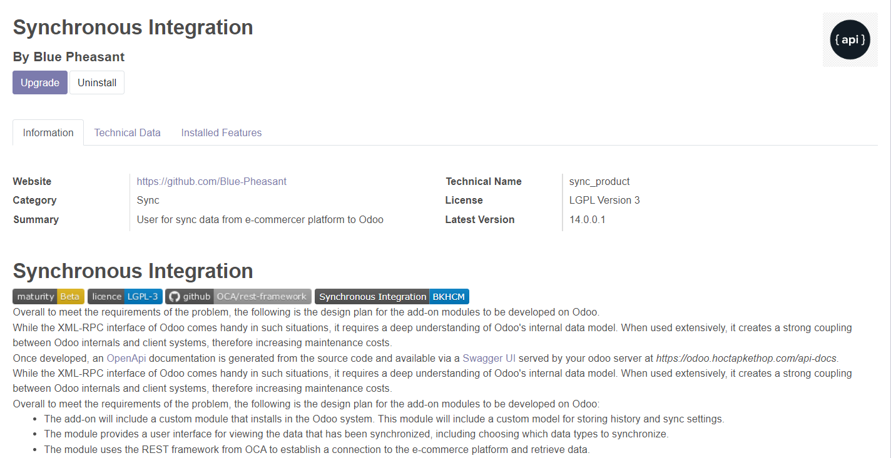
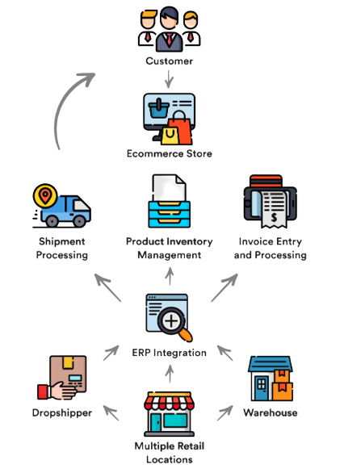

<p align="center">
  <a href="https://github.com/Blue-Pheasant/Odoo-connector">
    
    
    <h2 align="center">Odoo Connector</h2>
  </a>
</p> 
<p align="center">Odoo Connector is a powerful addons to develop, sync sale data by connector between Odoo (Open Source ERP) and any other software or service.</p>





*NOTE: If you are using this site as a template for your own portfolio site, I would be very glad if you add a link to the original site with my name in footer*

## :book: Context
Digital transformation refers to the use of digital technologies to fundamentally change the way businesses operate and deliver value to customers. For SMEs, digital transformation can bring many benefits.

We develop this Odoo addons for connect two platfrom `Odoo-ERP` and `E-Commerce`:


## :rocket: Quick start

**Run the site locally**

_NOTE: The default branch for this repo is `master`, when you push or pull make sure you specify the correct branch_

### Step 1: Clone The Repo

Fork the repository. then clone the repo locally by doing -

```bash
git clone https://github.com/Blue-Pheasant/Odoo-connector
```

### Step 2: Install Dependencies

Access into the project directory

```bash
cd Odoo-connector
```

Install all the dependencies in `__manifest__.py`
```bash
pip -r install requirements.txt
```

### Step 3: Install addons on Odoo Admin UI
Access Odoo Admin UI and use development mode then install Odoo-Connector addons in appstore.

## :open_file_folder: What's inside?

A quick look at the folder structure of this project.

    .
    │   README.md
    │   __init__.py
    │   __manifest__.py
    │
    ├───controllers
    │       order_controller.py      
    │       partner_controller.py    
    │       ping_controller.py       
    │       product_controller.py    
    │       __init__.py
    │
    ├───core
    │   │   naive_orm_model.py       
    │   │   pydantic_sync_order.py
    │   │   pydantic_sync_product.py
    │   │   pydantic_sync_product_short.py
    │   │   sync_product_search_param.py
    │   │   __init__.py
    │
    ├───demo
    ├───models
    │       sync_order.py
    │       sync_partner.py
    │       sync_product.py
    │       __init__.py

    ├───security
    │       ir.model.access.csv
    │
    ├───services
    │   │   exception_services.py
    │   │   sync_order_pydantic_services.py
    │   │   sync_order_services.py
    │   │   sync_product_pydantic_services.py
    │   |   sync_product_services.py
    │
    ├───static
    │   └───description
    │       └───diagram
    ├───tool
    ├───views
    └───wizard
        ├───accept_sync_product.py
        └───accept_sync_product.xml


## :v: Contributing

*NOTE: if you want to change the [blog content](./content) or fix any typo you can do that from github's ui without cloning the repo locally*

After cloning & setting up the local project you can push the changes to your github fork and make a pull request.

> You can also run the tests locally to see if everything works fine with

### Pushing the changes

```bash
git add .
git commit -m "commit message"
git push YOUR_REPO_URL master
```

------

## :books: Documentation
If you want in-depth knowledge about this project, then we have written them under the in-depth documents, with all the love, spread of the Ho Chi Minh university of Technology students in this project. [Read more](docs/README.md) [Watch remove](demo/demo.mp4)

Made with my :heart: and youthful enthusiasm
