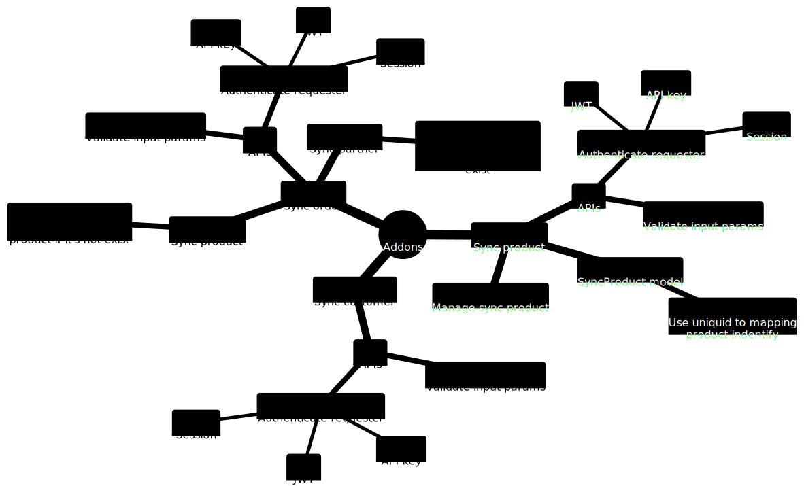

# Odoo Connector
Overall view of Odoo connector parts:

The solution for data synchronization between sales websites and Odoo-ERP system is to develop extensions on Odoo that have the ability to create APIs to move data. This extension is developed on top of OCA's Rest framework, which allows REST APIs to be easily integrated and used much more than Odoo's default XML-RPC. To implement this solution, the team will follow the steps in the following order: 
- Install the OCA REST framework packages: it provides a set of tools and libraries for building REST APIs in Odoo. 
- Define API endpoints: These endpoints may include methods for creating, reading, updating, and deleting data, such as products, customers, transactions, and orders.
- Write extensions: Use OCA's REST framework and Odoo development framework to write extensions that create API endpoints and handle data transfer between the sales funnel and the Odoo system.
- Testing and implementing extensions: After extensions are written, they are tested to ensure that the APIs work properly and that data is transmitted correctly.
- Integrate the API into the sales website: This can be done by adding code to the website that makes HTTP requests to the API endpoints to generate and read sales data.

# Summary
- Architecture
    * [Architecture](architecture/architecture.md)  
    * [Sync data](architecture/sync-data.md)

- Development
    * [Custom more feature](development/develop-new-feature.md)
    * [API services](development/api-services.md)
