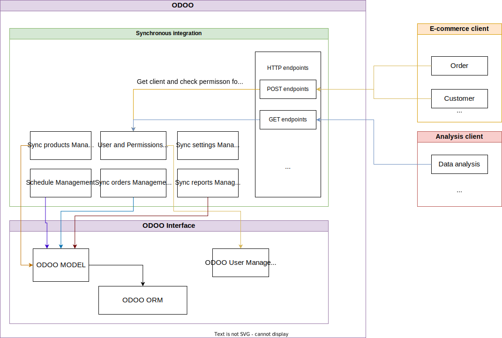
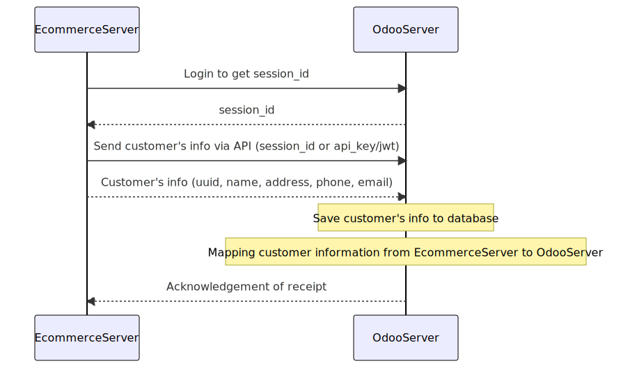
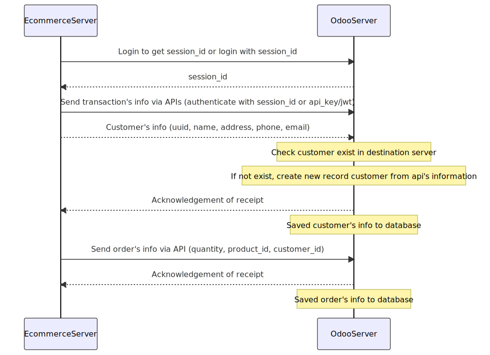
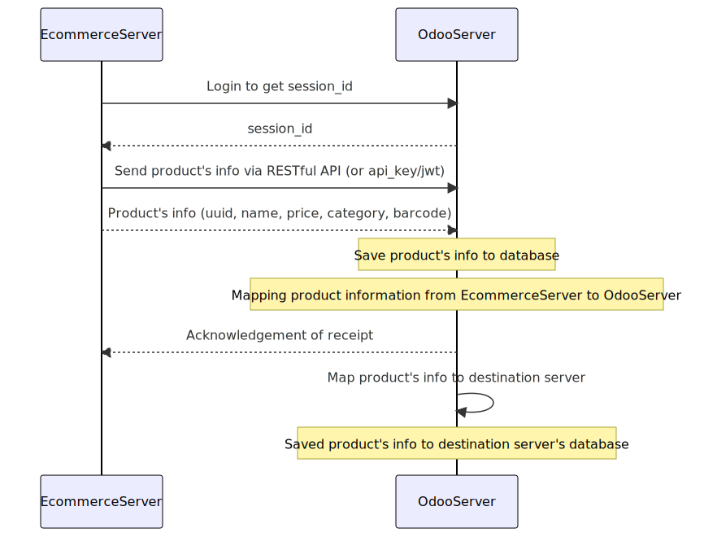

# Architect

Overall to meet the requirements of the problem, the following is the design plan for the add-on modules to be developed on Odoo: 
- The add-on will include one module: Customize settings in Odoo system. This module will include a custom model for storing history and sync settings. 
- The module provides a user interface for viewing the data that has been synchronized, including choosing which data types to synchronize. 
- The module uses the REST framework from OCA to establish a connection to the e-commerce platform and retrieve data. This module will handle errors and exceptions efficiently, with clear error messages displayed to the user if any problems occur during the synchronization.
- Scheduled action management module to run synchronization on a regular basis. This module will include a custom report template to display sync history and status. This design plan outlines the add-on's overall architecture and specific features, and will serve as a guide for the project implementation phase. 

Following is the general diagram for all Odoo Connector addons:

## Sync customer

## Sync order

## Sync product
