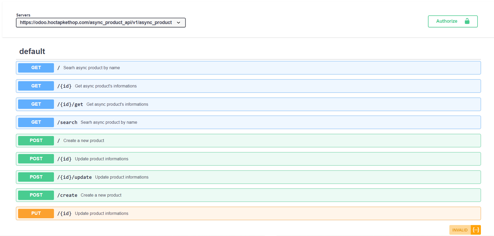

# API services
We developed at least three main api service to sync sale data as: customer, order and product information between `E-commerce` website and `Odoo-ERP`.

This is an example of sync product services api documents we hosted with `Open-API` framework:

